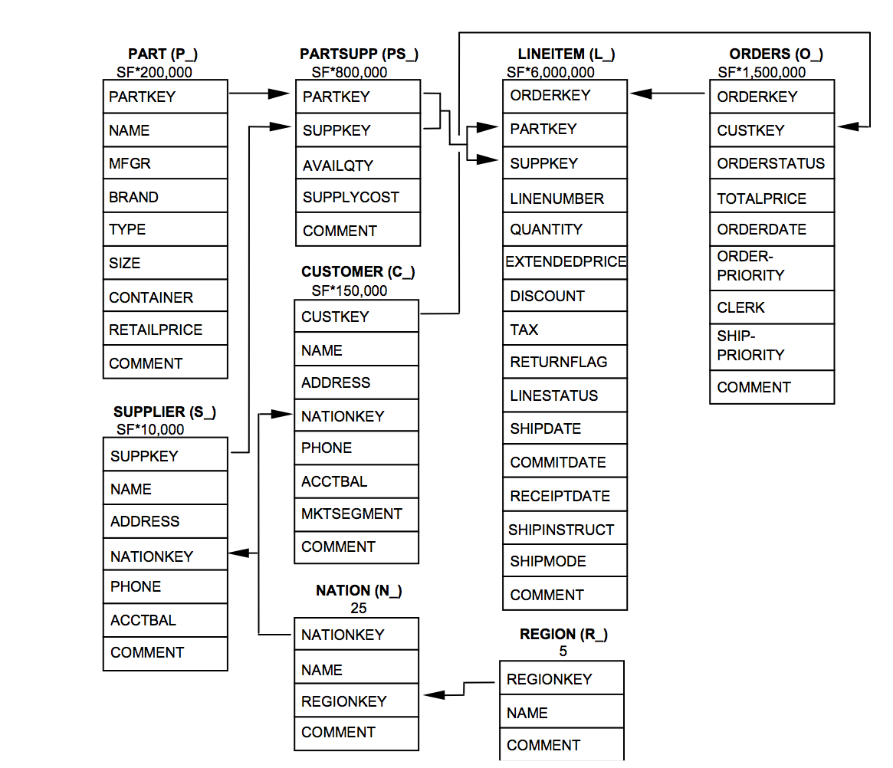

# Assignment 3, CMSC724, Spring 2015

*The assignment is to be done by yourself.*

This assignment has two parts: (1) write a simple client program in java that accesses the database using embedded SQL;
(2) understand the ANALYZE capabilities provided by PostgreSQL. We will use the PostgreSQL database system for this assignment.

**Submission: a single hardcopy containing everything would be preferred, but you can also send me a single email with the Java program, and any pdf or text files as separate attachments (please do not submit a zip file).**

## PART 1 (2 points)
One of more prominent ways to use a database system is using an external client, using APIs such as ODBC and JDBC.
This allows you to run queries against the database and access the results from within say a Java program.

Here are some useful links:
- [JDBC](http://en.wikipedia.org/wiki/Java_Database_Connectivity)
- [Step by Step Instructions (using an old JDBC driver)](http://www.mkyong.com/java/how-do-connect-to-postgresql-with-jdbc-driver-java)
- [JDBC PostgreSQL](http://jdbc.postgresql.org/index.html)

The last link has detailed examples in the `documentation` section.

### Your Task: Write a Java program to do the same thing as Question 4 from the SQL assignment:

```
4. For 2004 Olympics, generate a list - (birthyear, num-players, num-gold-medals) - 
containing the years in which the atheletes were born, the number of players
born in each of those years who won at least one gold medal, and the number of gold 
medals won by the players born in that year.
```
... with the constraint that you can only issue a simple query to the database that does the join between 
the three relations. Specifically, you should only issue the following query to the database, rest
of the processing should be done in the Java program:

```
select p.birthdate, p.player_id
from results r, events e, players p 
where p.player_id = r.player_id and e.event_id = r.event_id 
      and e.olympic_id = 'ATH2004'and r.medal = 'GOLD'
```

You should submit the Java program, and the answer itself should be submitted along with the rest of the assignment.

## PART 2 (0.5+0.5+0.5+0.5+1=3 points)
Like most other database systems, PostgreSQL allows you to analyze query execution plans, and tune the execution. 
The main PostgreSQL commands are EXPLAIN and EXPLAIN ANALYZE. The first one simply prints out 
the plan, but the second one also runs the query and compares the estimated values with 
actual values observed during execution.

An important accompanying command is `VACUUM ANALYZE`; this recalculates all the statistics
used by PostgreSQL optimizer.

The assignment here is to answer 5 questions using these tools. The questions are
present in the accompanying `assignment-analyze.sql` file. Most of the questions use
a modified TPC-H Benchmark database, more details are available at: [TPC-H](http://www.tpc.org/tpch)


